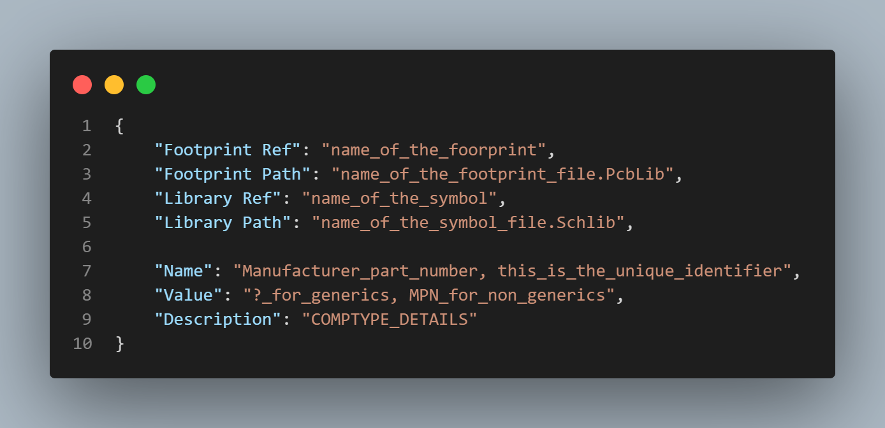

# FW-Altium-Lib

FW-Altium-Lib is a lightweight Altium component library you can drop into any project in minutes. Plain JSON files keep everything scriptable, versionable, and easy to share with your team.
This repository bundles symbols, footprints, and a compact database that Altium reads through a DbLib. The Python helpers build that database from simple component files and can guide you through creating consistent new parts.

| Feature | FW-Altium-Lib | Altium 365 | KiCad | EasyEDA |
| :-- | :--: | :--: | :--: | :--: |
| Open, readable data | Yes | No | Yes | No |
| Full Git integration | Yes | Limited | Yes | No |
| Automation tooling | Yes | Partial | Partial | Partial |
| AI-generated descriptions | Yes | No | No | No |
| Altium-native compatibility | Yes | Yes | No | No |
| Cloud collaboration | GitHub | Yes | Via Git | Yes |
| Portability / no lock-in | Yes | No | Yes | No |

## Library structure


```
FW-ALTIUM-LIB/
  assets/                      # Images used in the README + docs
  components/                  # One JSON file per component
  footprints/                  # *.PcbLib footprint libraries (+ templates)
  symbols/                     # *.SchLib symbol libraries (+ templates)
  knowledge/                   # Shared prompt + description standards
  create_component.py          
  generate.py                  
  fw_lib.DbLib                 
  requirements.txt             
  README.md
```

- Running `generate.py` aggregates all `components/*.json`, normalizes library paths, and outputs:
  - `fw-altium-lib.json` (machine-readable DB)
  - `fw_lib_generated.xlsx` (for Altium DbLib + human inspection).
- `create_component.py` is an interactive helper that can:
  - generate a one-line description automatically (OpenAI), or fall back to a manual prompt,
  - create the JSON, copy symbol/footprint templates if needed, and open them for edits.
- Description style is defined in `component_description_standards.md` and the prompt in `auto_description_prompt.txt`.

---

## Requirements

- Python 3.9+ (tested with CPython)  
- `pip install -r requirements.txt` (includes `pandas`/`openpyxl` for Excel export. Packaging tools like PyInstaller/Nuitka are optional).

> If you don't need a standalone EXE, you can ignore the packaging tools in `requirements.txt`.

---
## Quickstart

1. **Install deps**
   ```bash
   pip install -r requirements.txt
   ```

2. **Generate the database**
   ```bash
   python generate.py
   ```
   This scans `components/*.json`, prefixes paths for symbols/footprints, writes `fw-altium-lib.json` and `fw_lib_generated.xlsx`.

3. **Point Altium to the DbLib**

    Add existing to project
    
    
    
    Add the DbLib file to the project
    
    
    
    Now the library will appear in the component panel
    
    
    
---

## Using the library

### Option 1: Git submodule (best for versioning)

1. Add the library as a submodule inside your hardware project:
   ```bash
   git submodule add https://github.com/FutureWave-eng/fw-altium-lib.git lib/fw-altium-lib
   ```
2. Commit the submodule pointer whenever the library changes so each design keeps the right revision.
3. Inside `lib/fw-altium-lib`, run `python generate.py` after you add or edit components.
4. In Altium, point the project to `lib/fw-altium-lib/fw_lib.DbLib`.

### Option 2: Shared local checkout (fast for experiments)

1. Clone the repo once to a folder every project can reach, for example `C:\Altium\fw-altium-lib`:
   ```bash
   git clone https://github.com/FutureWave-eng/fw-altium-lib.git C:\Altium\fw-altium-lib
   ```
2. Run `python generate.py` whenever you pull updates or add new parts.
3. In each design, reference the shared `fw_lib.DbLib` so all projects see the same library.

> Choose the submodule workflow when you need deterministic, per-project versioning. Use the shared checkout when you want a single always-up-to-date library on your machine.

---

# How components work

Each component is just a small JSON file. The generator combines them and **fixes paths** so Altium can find the right symbol and footprint.

### JSON schema

  

- Keep `Library Path` and `Footprint Path` as **filenames only**; the generator will prefix `symbols/` and `footprints/` automatically.

**Example from this repo**

- Optocoupler


---

## Adding components

Pick the guided helper for speed, or edit the JSON directly if you prefer.

### Option A - interactive helper (recommended)

1. Run `python create_component.py`.
2. Enter the manufacturer part number and choose whether the schematic value matches the MPN or stays parameterized.
3. Accept the AI-generated description (requires `OPENAI_API_KEY`) or write one manually with `component_description_standards.md`.
4. Select a symbol:
   - Reuse an existing `.SchLib` when possible.
   - If you need a new one, duplicate `AA_SymbolTemplate.SchLib` or pull a part from the [Celestial library](https://github.com/issus/altium-library/tree/master/symbols), then adjust pins and names.

   

5. Select a footprint:
   - Link to existing footprints first.
   - Otherwise duplicate `AA_FootprintTemplate.PcbLib` or import from the [Celestial library](https://github.com/issus/altium-library/tree/master/footprints), then update pad sizes and 3D body as needed.

   

6. Confirm to write `components/<MPN>.json`, then run `python generate.py` to refresh the database.

> Environment variables: `OPENAI_API_KEY` enables the auto description flow. `OPENAI_MODEL` is optional (defaults to `gpt-4o-mini`).

### Option B - manual JSON

1. Copy an example JSON from `components/` and rename it to your part number.
2. Update the fields following the schema above; keep symbol and footprint paths as filenames only.
3. Run `python generate.py` to regenerate `fw_lib_generated.xlsx`.

---

## Description & naming standards

- **Goal**: a single, compact line that helps engineers pick the right part and footprint at a glance (no marketing claims).  
- **Canonical formats** and examples for many categories (diodes, caps, MOSFETs, LEDs, chokes, connectors, etc.) live in `component_description_standards.md`. Keep extending it as needed.  
- The **same table** is embedded into `auto_description_prompt.txt` so the AI can follow the exact style when generating a description.

---

## Generating the database

```bash
python generate.py
```

What happens:

- All `components/*.json` are loaded.  
- `Library Path` is prefixed with `./symbols/` and `Footprint Path` with `./footprints/`.  
- The merged dataset is written to `fw-altium-lib.json` and also exported to `fw_lib_generated.xlsx`.  
- The script prints the component count when done.

Open or refresh `fw_lib.DbLib` in Altium so it points at the **latest** `fw_lib_generated.xlsx`.

---
## Tips for teams

- **Reuse first**: Prefer linking existing symbols/footprints before making new ones.  
- **Templates**: Start from `AA_SymbolTemplate.SchLib` / `AA_FootprintTemplate.PcbLib` when you must create new ones (the helper script automates this).  
- **Consistent naming**: Follow the formats in the standards file for predictable search and filtering.  
- **Small PRs**: One part per pull request is ideal.

---

## Contributing

1. Fork and create a feature branch.  
2. Add or update components:
   - JSONs under `/components`
   - New symbols under `/symbols`, footprints under `/footprints`
4. Include a brief note explaining your description line and any new symbol/footprint decisions.  
5. Open a PR.

**PR checklist**

- [ ] Description follows the style guide.  
- [ ] Reused existing symbol/footprint where possible.
- [ ] Schematic and Footprint are valid and checked with datasheet.

---

## FAQ

**Q: Do I need the OpenAI key?**  
A: No. Without it the helper asks you to write the description manually and opens the standards for guidance.

**Q: Where do I edit a new symbol/footprint after creation?**  
A: The helper copies the templates to the correct filenames and opens them for you; you can also open them directly in Altium under `/symbols` and `/footprints`.

**Q: Why are my paths "just filenames" in JSON?**  
A: The generator prefixes `symbols/` and `footprints/` automatically to keep repo portability.

---

Happy building! If anything's unclear or you hit friction, open an issue with the component JSON you tried and the error you saw.

## License

All design sources and helper scripts in FW-Altium-Lib are licensed under the CERN Open Hardware Licence Version 2 – Permissive (CERN-OHL-P v2.0).  
© 2023–2025 FutureWave SRL. See [LICENSE](./LICENSE) for the full text and obligations around attribution and documenting modifications. 

